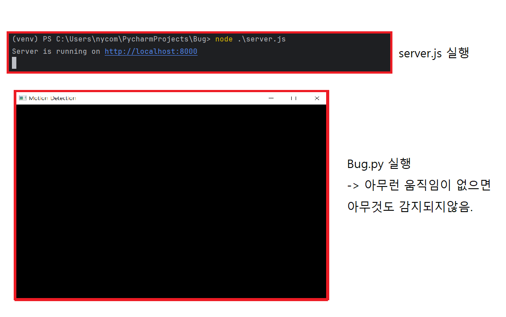
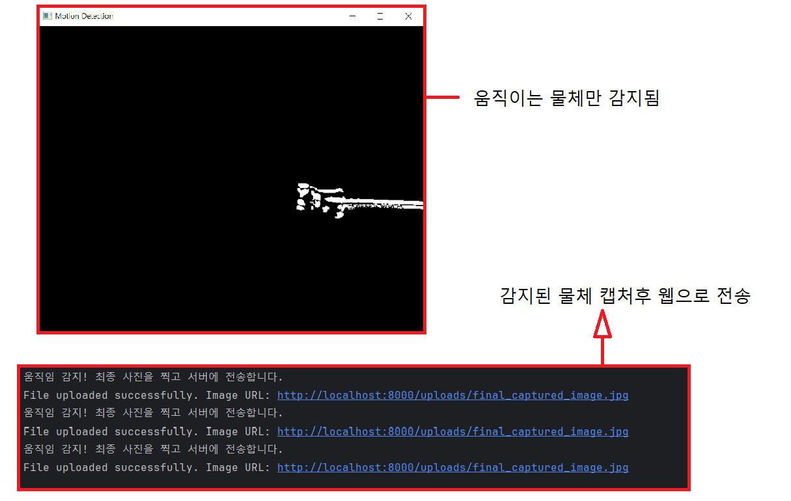

# Bug-Detector

1) 목적 : 빈대로 인한 사람들의 불편함 해소를 위해, 벌레 감지기 개발
2) 개발 환경 : Python / Linux Ubntu/ Node.js / open cv
3) 주요 기능
1. 카메라 범위 내에 움직이는 물체 감지 가능.(python & open cv)

- 움직임이 있는지 확인
1.diff = cv2.absdiff(prev_frame, frame)   #현재 프레임과 이전 프레임 사이의 차이를 계산.
2.gray_diff = cv2.cvtColor(diff, cv2.COLOR_BGR2GRAY)  # 차이 이미지를 회색조로 변환.
3._, threshold = cv2.threshold(gray_diff, 30, 255, cv2.THRESH_BINARY)  # 이진 이미지로 변환.

- 물체의 중점 좌표를 얻어오는 로직 (예시로 임의로 x, y 설정)
4.if cv2.countNonZero(threshold) > 500:

2. node.js를 통해, 캡쳐 이미지 전송 서버 구축

- 서버에 최종 이미지 업로드
1.server_url = 'http://localhost:8000/upload'
2.files = {'image': open('final_captured_image.jpg', 'rb')}
3.response = requests.post(server_url, files=files)

# 구성도

